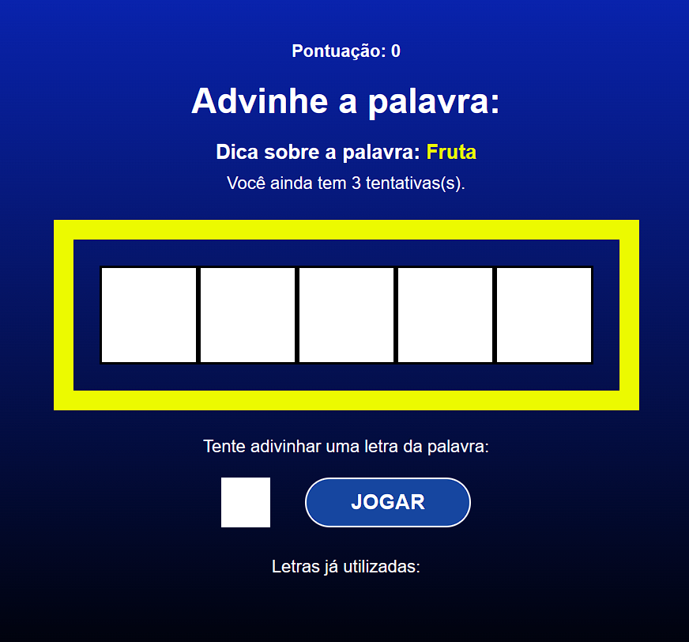

<h1 align="center"> <a href=""> Secret Word </a></h1>

 

<h3 align='center'> Projeto realizado no curso <em> React do Zero a Maestria (c/ hooks, router, API, Projetos) </em> na Udemy para praticar alguns conceitos do React. </h3>

 

---------------------------------------

  <h2>Imagem do projeto:</h2>
  

 

  <h2>Tecnologias usadas:</h2>
   -
   -
  
  
    

  ## <a href = ""> Veja o projeto aqui. </a>

